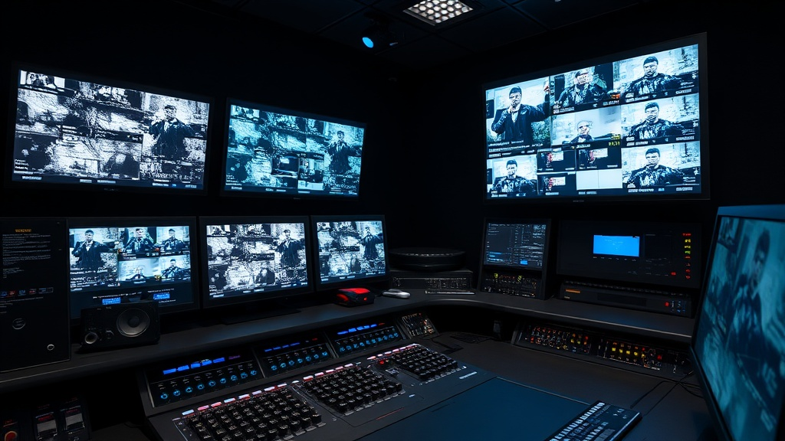
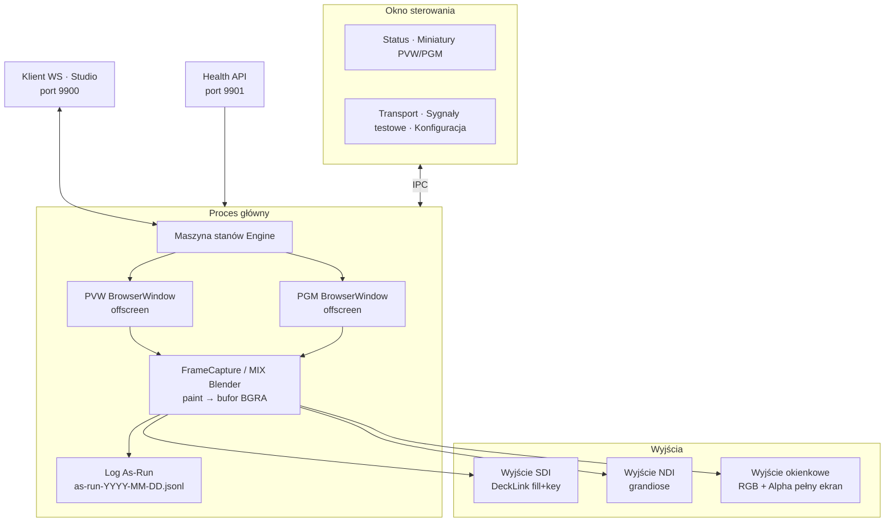

Wersja polska | [English](README.md)

<div align="center">



# Veles Playout

**Samodzielny renderer grafiki nadawczej** dla platformy automatyzacji TV Pellar

[](https://www.electronjs.org/)
[](https://www.typescriptlang.org/)

[](LICENSE)

</div>

---

Renderuje szablony nakładek HTML/CSS za pomoca offscreen renderingu Chromium i wyprowadza nieskompresowane klatki na DeckLink SDI, NDI oraz okna pełnoekranowe. Sterowany zdalnie z [Veles Studio](https://github.com/veles-productions/veles-studio) przez WebSocket.

## Pobieranie

Najnowszą wersję znajdziesz na stronie [GitHub Releases](https://github.com/veles-productions/veles-playout/releases/latest):

| Plik | Opis |
|------|------|
| `Veles-Playout-x.x.x-Setup.exe` | Instalator Windows (automatyczne aktualizacje) |
| `Veles-Playout-x.x.x-Portable.exe` | Wersja przenośna — uruchom z dowolnego folderu |

**Wymagania:** Windows 10/11 64-bit. Opcjonalny sprzęt do wyjścia nadawczego:
- Sterowniki [Blackmagic Desktop Video](https://www.blackmagic-design.com/support/) dla DeckLink SDI
- [NDI Runtime](https://ndi.video/tools/) dla wyjścia NDI

## Szybki start

1. **Uruchom** aplikację — otworzy się okno sterowania ze statusem, monitorami i panelami konfiguracji
2. **Załaduj sygnał testowy** — kliknij SMPTE w sekcji Test Signals
3. **Wyemituj na antenę** — naciśnij Spację lub kliknij czerwony przycisk TAKE. Status zmieni się na ON AIR
4. **Wyczyść** — naciśnij Escape lub kliknij CLEAR, aby wrócić do STANDBY

Aby połączyć się z Veles Studio, otwórz stronę Output i wpisz `ws://localhost:9900` (lub IP maszyny z playoutem) w panelu konektorów.

## Funkcjonalności

### Silnik
- **Maszyna stanów PVW/PGM** — standardowy workflow podgląd/program z przejściem TAKE o zerowym opóźnieniu (zamiana okien, bez ponownego renderowania)
- **Przejście MIX** — crossfade klatek BGRA w czasie rzeczywistym między wychodzącą a wchodzącą treścią, konfigurowalna długość (250ms-2s)
- **Sterowanie transportem** — PLAY, STOP, TAKE, CLEAR, FREEZE ze skrótami klawiaturowymi (Spacja, Escape, F)
- **Aktualizacja na żywo** — zmiana zmiennych szablonu na wyjściu PGM bez ponownego TAKE (`updatePgm`)

### Wyjście
- **Wiele jednoczesnych wyjść** — SDI (DeckLink fill+key), NDI, okno pełnoekranowe (RGB + Alpha)
- **Odporność wyjść** — automatyczne wyłączanie wadliwych wyjść po 10 błędach w celu ochrony pipeline
- **Black burst** — czyste czarne klatki na SDI/NDI przy braku aktywności (brak śmieciowego sygnału)

### Szablony
- **Rendering HTML/CSS** — zmienne dynamiczne, animacje CSS, przezroczyste tło
- **Obsługa OGraf** — [EBU Open Graphics](https://www.ebu.ch/groups/open-graphics) Web Components z dynamiczną rozdzielczością i częstotliwością klatek
- **Wbudowane sygnały testowe** — wzorce SMPTE, Bars, Grid, Ramp z opcjonalnymi wariantami alpha

### Operacje nadawcze
- **Log as-run** — dziennik JSON Lines (`as-run-YYYY-MM-DD.jsonl`) rejestrujący każde zdarzenie take, clear, freeze, load i crash
- **Odzyskiwanie po awarii** — automatyczny restart renderera po crashu, PGM przechodzi na black burst, klienci WS powiadomieni
- **Endpoint HTTP health** — `/health` (JSON) i `/metrics` (format Prometheus) na porcie 9901
- **Miniatury PVW/PGM na żywo** — thumbnails JPEG 4fps strumieniowane do okna sterowania

### Łączność
- **Sterowanie WebSocket** — protokół JSON na porcie 9900, przyjmuje polecenia z Veles Studio lub dowolnego klienta
- **Autoryzacja WS** — opcjonalna autoryzacja tokenem przez parametr query
- **Wykrywanie sprzętu** — automatyczne wykrywanie urządzeń DeckLink, runtime NDI i podłączonych monitorów
- **Automatyczne aktualizacje** — sprawdzanie GitHub Releases przy uruchomieniu, instalacja aktualizacji przy zamykaniu

## Architektura



**Stany silnika:** `idle` → `pvw-loaded` → `on-air` ⇆ `frozen`

**CUT:** Zamiana referencji BrowserWindow PVW/PGM — zero opóźnień, bez ponownego renderowania.
**MIX:** Podwójne przechwytywanie obu okien podczas przejścia, mieszanie buforów BGRA piksel po pikselu z arytmetyką całkowitoliczbową (mnożenie + przesunięcie, pętla rozwinięta 4-krotnie), wyprowadzanie zblendowanych klatek na wyjścia.

## Protokół WebSocket

Połączenie pod `ws://localhost:9900`. Z włączoną autoryzacją: `ws://localhost:9900?token=YOUR_TOKEN`.

### Polecenia (klient → playout)

```jsonc
// Załaduj szablon do podglądu
{ "type": "load", "payload": { "templateHtml": "<div>{{headline}}</div>", "templateCss": "div { color: white; }", "variables": { "headline": "Breaking News" } } }

// Załaduj szablon OGraf
{ "type": "load", "payload": { "templateHtml": "...", "isOGraf": true, "ografManifest": { ... }, "variables": { "headline": "Breaking" } } }

// Zaktualizuj zmienne w podglądzie
{ "type": "update", "payload": { "variables": { "headline": "Updated" } } }

// Zaktualizuj zmienne na żywym PGM (bez ponownego TAKE)
{ "type": "updatePgm", "payload": { "variables": { "headline": "Live Edit" } } }

// Transport
{ "type": "take" }                                          // Przejście CUT
{ "type": "take", "payload": { "transition": "mix", "duration": 1000 } }  // Crossfade MIX
{ "type": "clear" }      // Wyczyść PGM (koniec emisji)
{ "type": "play" }       // Odtwórz animację
{ "type": "stop" }       // Zatrzymaj animację
{ "type": "freeze" }     // Przełącz zamrożenie PGM

// Sygnał testowy
{ "type": "testSignal", "payload": { "pattern": "smpte", "alpha": false } }

// Zapytanie
{ "type": "status" }     // Pobierz stan silnika
{ "type": "getInfo" }    // Pobierz wersję, rozdzielczość, info o sprzęcie
```

### Zdarzenia (playout → klient)

```jsonc
{ "type": "state", "payload": { "state": "on-air", "pvwReady": true, "pgmReady": true, "mixing": false, ... } }
{ "type": "frameUpdate", "payload": { "fps": 25, "dropped": 0 } }
{ "type": "info", "payload": { "version": "0.1.1", "resolution": { "width": 1920, "height": 1080 }, ... } }
{ "type": "ack", "id": "cmd-123", "payload": { "success": true } }
{ "type": "error", "payload": { "message": "No template loaded in preview" } }
```

## Stan i monitoring

### Endpoint HTTP Health (port 9901)

```bash
# Health check JSON
curl http://localhost:9901/health
# → { "status": "ok", "engine": "on-air", "fps": 25, "dropped": 0, "uptime": 3600, "clients": 2, "version": "0.1.1" }

# Metryki Prometheus
curl http://localhost:9901/metrics
# → veles_playout_on_air 1
# → veles_playout_fps 25
# → veles_playout_dropped_frames_total 0
# → veles_playout_frames_total 90000
# → veles_playout_uptime_seconds 3600
# → veles_playout_ws_clients 2
```

Zwraca HTTP 503 gdy aplikacja nadaje, ale fps=0 (stan degradacji).

### Log As-Run

Dziennik nadawczy zapisywany do `%APPDATA%/veles-playout/as-run/as-run-YYYY-MM-DD.jsonl`:

```jsonl
{"timestamp":"2026-02-18T14:30:00.000Z","event":"load","templateId":"lower-third-1"}
{"timestamp":"2026-02-18T14:30:01.200Z","event":"take","templateId":"lower-third-1","variables":{"headline":"Breaking News"}}
{"timestamp":"2026-02-18T14:30:45.000Z","event":"clear"}
{"timestamp":"2026-02-18T14:31:00.000Z","event":"crash-recovery","details":"PGM crash: killed"}
```

## Skróty klawiaturowe

| Klawisz | Akcja |
|---------|-------|
| Spacja | TAKE |
| Escape | CLEAR |
| F | FREEZE |

---

## Rozwój

### Wymagania wstępne

- Node.js 22+
- npm 10+

### Konfiguracja

```bash
git clone https://github.com/veles-productions/veles-playout.git
cd veles-playout
npm install
```

> `macadam` (SDI) i `grandiose` (NDI) to zależności opcjonalne — nie zainstalują się, jeśli nie masz SDK sprzętowych. Aplikacja działa poprawnie bez nich.

### Polecenia

```bash
npm run dev          # Rozwój z hot reload
npm run build        # Kompilacja TypeScript (electron-vite)
npm run dist         # Build + stworzenie instalatora Windows + przenośna wersja
npm run dist:portable  # Build + tylko przenośny exe
npm run release      # Build + publikacja na GitHub Releases
npm test             # Uruchomienie testów (vitest)
```

### Struktura projektu

```
src/
  main/                    # Proces główny Electron (Node.js)
    index.ts               # Wejście aplikacji, tworzenie okien, IPC, cykl życia
    engine.ts              # Maszyna stanów PVW/PGM (load/take/takeMix/clear/freeze)
    capture.ts             # Offscreen paint event → bufor klatek BGRA
    ws-server.ts           # Serwer sterowania WebSocket (port 9900)
    config.ts              # Trwałe ustawienia (electron-store)
    hardware.ts            # Wykrywanie SDI/NDI/monitorów
    health.ts              # HTTP health + metryki Prometheus (port 9901)
    as-run-log.ts          # Logger dziennika nadawczego JSON Lines
    ipc.ts                 # Stałe kanałów IPC i typy wiadomości
    template/
      builder.ts           # Budowanie dokumentu HTML szablonu
      ograf.ts             # Budowanie strony hosta OGraf (EBU)
      paths.ts             # Zarządzanie katalogiem cache szablonów
      test-signals.ts      # Wbudowane generatory SMPTE/Bars/Grid/Ramp
    output/
      manager.ts           # Routing klatek do wszystkich wyjść (z odpornością na błędy)
      blackburst.ts        # Generator czarnych klatek dla bezczynnych SDI/NDI
      sdi.ts               # Wyjście DeckLink SDI (macadam)
      ndi.ts               # Wyjście NDI (grandiose)
      window.ts            # Wyjście okienkowe pełnoekranowe (RGB + Alpha)
  renderer/
    control/               # Dashboard okna sterowania (React)
      App.tsx              # Status, miniatury PVW/PGM, transport, konfiguracja
      index.html           # Wejście okna sterowania
    template/              # Strona hosta renderingu offscreen
      index.html           # Cel wstrzykiwania szablonów
    output/                # Okna pełnoekranowe canvas
      rgb.html             # Wyjście RGB (fill)
      alpha.html           # Wyjście Alpha/key
  preload/
    index.ts               # contextBridge dla IPC okna sterowania
    output.ts              # contextBridge dla okien wyjściowych
```

### Konfiguracja ustawień

Ustawienia są przechowywane przez `electron-store` i zachowywane między sesjami:

| Ustawienie | Domyślnie | Opis |
|------------|-----------|------|
| `wsPort` | `9900` | Port serwera WebSocket |
| `wsAuthToken` | `""` | Token autoryzacji dla połączeń WS (pusty = brak autoryzacji) |
| `healthPort` | `9901` | Port endpointu HTTP health (0 = wyłączony) |
| `frameRate` | `25` | Docelowe FPS (25 = PAL, 30 = NTSC) |
| `resolution` | `1920x1080` | Rozdzielczość renderowania |
| `rgbMonitor` | `-1` (wyłączony) | Indeks monitora dla okna RGB pełnoekranowego |
| `alphaMonitor` | `-1` (wyłączony) | Indeks monitora dla okna Alpha/key |
| `sdi.enabled` | `false` | Włączenie wyjścia DeckLink SDI |
| `sdi.fillDevice` | `0` | Indeks urządzenia DeckLink dla fill |
| `sdi.keyDevice` | `1` | Indeks urządzenia DeckLink dla key |
| `ndi.enabled` | `false` | Włączenie wyjścia NDI |
| `ndi.senderName` | `Veles Playout` | Nazwa źródła NDI w sieci |
| `cacheMaxBytes` | `524288000` | Maksymalny rozmiar cache szablonów (500MB) |

### CI/CD

GitHub Actions buduje przy każdym pushu na `main`. Aby stworzyć release:

```bash
# Zwiększ wersję w package.json, a potem:
git tag v0.1.1
git push origin v0.1.1
```

Workflow buduje instalator NSIS i przenośny exe, a następnie publikuje je jako draft GitHub Release. Opublikuj draft, aby udostępnić go do pobrania i automatycznych aktualizacji.

## Powiązane repozytoria

- [veles-studio](https://github.com/veles-productions/veles-studio) — Interfejs operatorski (wysyła polecenia przez WebSocket)
- [veles-core](https://github.com/veles-productions/veles-core) — Backend API (baza szablonów, pipeline agentów)
- [veles-gpu](https://github.com/veles-productions/veles-gpu) — Serwer inferencji GPU (LLM, embeddingi, generowanie obrazów)

## Licencja

MIT
